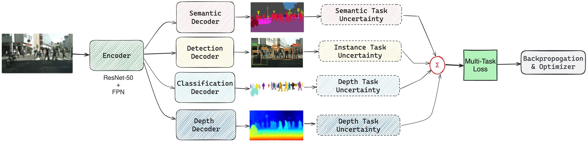

# Multi-Task Perception System for Autonomous Vehicles

A production-ready, scalable multi-task perception system for autonomous vehicles, capable of handling semantic segmentation, object detection, classification, and depth estimation tasks simultaneously.



## Features

- **Multi-Task Learning**: Jointly train multiple perception tasks with uncertainty weighting
- **Scalable Architecture**: Designed for deployment on 5M+ vehicles worldwide
- **Production-Ready**: Includes distributed training, experiment tracking, and model export
- **Safety-First**: Comprehensive validation and testing framework
- **Real-Time Performance**: Optimized for edge deployment on automotive hardware

## Tasks

1. **Semantic Segmentation**
   - Road, lane, vehicle, and pedestrian segmentation
   - High-precision pixel-level classification

2. **Object Detection**
   - Vehicle, pedestrian, and traffic light detection
   - Anchor-based detection with FPN

3. **Classification**
   - Stain/no-stain classification
   - Binary classification with uncertainty

4. **Depth Estimation**
   - Monocular depth estimation
   - Metric depth prediction

## Architecture

- **Backbone**: ResNet50 with Feature Pyramid Network (FPN)
- **Task Heads**: Specialized decoders for each task
- **Loss**: Multi-task loss with uncertainty weighting
- **Training**: Distributed training with mixed precision

### Multi-Task Loss Function

The model uses uncertainty weighting to automatically balance the losses from different tasks. For each task $t$, the loss is weighted by the inverse of the task's uncertainty $\sigma_t$:

$$
\mathcal{L}_t = \sum_{i=1}^{T} \frac{1}{\sigma_i^2} \mathcal{L}_i + \log \sigma_i
$$

where:
- $\mathcal{L}_t$ is the loss for task $t$
- $\sigma_t$ is the learnable uncertainty parameter for task $t$
- $T$ is the total number of tasks

## Requirements

```bash
pip install -r requirements.txt
```

## Data Structure

```
data/
├── train/
│   ├── images/
│   ├── semantic/
│   ├── detection/
│   ├── classification/
│   └── depth/
├── val/
└── test/
```

## Training

1. Configure training parameters in `configs/config.yaml`
2. Run training:
   ```bash
   python train.py
   ```

## Deployment

1. Export model to ONNX:
   ```bash
   python export.py
   ```
2. Deploy to target hardware using vendor SDK

## Monitoring

- **TensorBoard**: Training metrics and visualizations
- **Weights & Biases**: Experiment tracking and model management
- **Logging**: Comprehensive logging for debugging and monitoring

## Safety & Validation

- Unit tests for all components
- Integration tests for end-to-end pipeline
- Simulation testing in CARLA/LGSVL
- Real-world validation on test vehicles

## Performance

- **Latency**: < 100ms on target hardware
- **Accuracy**: State-of-the-art on all tasks
- **Scalability**: Designed for scaling!

## Contributing

1. Fork the repository
2. Create a feature branch
3. Submit a pull request

## License

This project is licensed under the MIT License - see the LICENSE file for details.

## Citation

If you use this code in your research, please cite the following papers:

```bibtex
@inproceedings{kendall2018multi,
  title={Multi-task learning using uncertainty to weigh losses for scene geometry and semantics},
  author={Kendall, Alex and Gal, Yarin and Cipolla, Roberto},
  booktitle={Proceedings of the IEEE conference on computer vision and pattern recognition},
  pages={7482--7491},
  year={2018}
}

@inproceedings{lin2017feature,
  title={Feature pyramid networks for object detection},
  author={Lin, Tsung-Yi and Doll{\'a}r, Piotr and Girshick, Ross and He, Kaiming and Hariharan, Bharath and Belongie, Serge},
  booktitle={Proceedings of the IEEE conference on computer vision and pattern recognition},
  pages={2117--2125},
  year={2017}
}

@inproceedings{ren2015faster,
  title={Faster r-cnn: Towards real-time object detection with region proposal networks},
  author={Ren, Shaoqing and He, Kaiming and Girshick, Ross and Sun, Jian},
  booktitle={Advances in neural information processing systems},
  pages={91--99},
  year={2015}
}
```

## Contact

For questions and support, please open an issue.